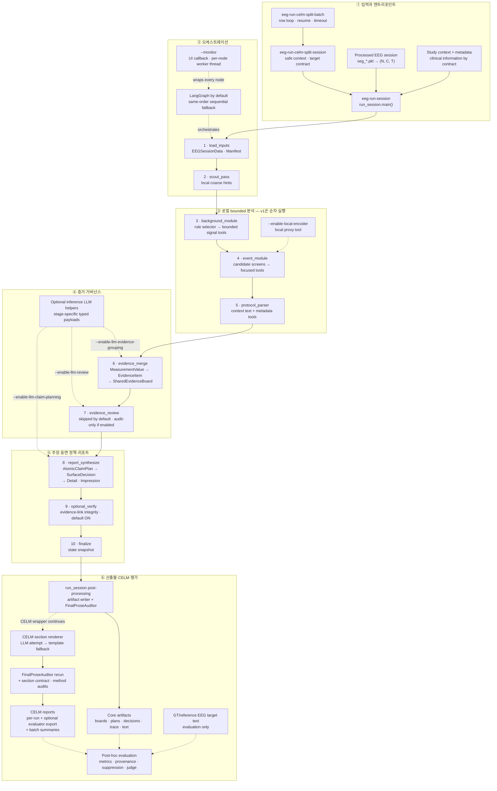

# EEG Report Multi-Agent v1

처리된 장시간 EEG를 **제한된 로컬 도구**로 측정하고, 추적 가능한 증거·원자 주장·표면 정책을 거쳐 임상의용 리포트로 렌더링하는 evidence-first 연구 파이프라인입니다.



> **범례:** 실선은 해당 진입 경로에서 실행되는 데이터 흐름, 점선은 flag 기반 옵션·오케스트레이션 보조·CELM/평가 전용 흐름입니다. CELM-managed path 또는 호출자가 입력 계약을 지킨 direct run의 **inference adapter**에는 raw EEG 배열, PKL payload/path, GT/reference EEG target-section text를 전달하지 않습니다. GT/generated text를 비교하는 post-hoc LLM judge는 별도 평가 경로입니다.

## 30초 요약

- 기본 진입점은 `eeg-run-session → run_session.main() → run_pipeline()`입니다.
- 실제 그래프는 병렬 멀티에이전트가 아니라 **10개 노드의 선형 실행**입니다. LangGraph와 `--no-langgraph` fallback은 같은 순서를 사용합니다.
- `BackgroundAgent`와 `EventAgent`는 자율 LLM agent가 아니라 허용된 registry 안에서만 도구를 선택하는 **rule-based bounded selector**입니다.
- 기본 중간 표현은 `MeasurementValue → EvidenceItem → SharedEvidenceBoard → AtomicClaimPlan → SurfaceDecision → ReportSection`입니다.
- 기본 `eeg-run-session`의 리포트 합성은 deterministic template 기반입니다. LLM evidence grouping, review, claim planning은 각각 flag로 켭니다.
- `ClaimVerifier`는 임상 정확도를 다시 판독하지 않고 SharedEvidenceBoard의 `claim_evidence_links`를 기준으로 link integrity를 검사합니다.
- `FinalProseAuditor`는 그래프 밖의 사후 감사입니다. 감사 판정은 이미 생성된 문장을 수정하거나 gate하지 않지만, auditor 자체의 예상치 못한 예외는 CLI를 중단시킬 수 있습니다.
- CELM wrapper는 core 실행 뒤 final section LLM rendering을 항상 시도하며, API/key 오류 시 기존 atomic claim plan의 template rendering으로 fallback합니다.
- 현재 입력은 raw EDF가 아니라 `seg_*.pkl`로 구성된 processed session입니다.

## 폴더 구조

```text
.
├── README.md                              # 이 실행·구조 지도
├── EEG_MULTIAGENT_MAIN_EXECUTION_READING_MAP.md
├── pyproject.toml                         # package deps + 23 console scripts
├── Dockerfile
├── configs/
│   ├── clinical_slot_schema.yaml          # provenance evaluation에서 사용
│   ├── evaluation_failure_taxonomy.yaml   # provenance evaluation에서 사용
│   ├── claim_gate_policy.yaml             # provenance evaluation에서만 사용
│   ├── base.yaml                          # core가 읽지 않는 참고 snapshot
│   ├── graph.yaml                         # core가 읽지 않는 참고 snapshot
│   └── tool_registry.yaml                 # core가 읽지 않는 참고 snapshot
├── scripts/
│   ├── start_container.sh                 # image build + interactive container
│   ├── mt_container.sh                    # 기존 container 제어 helper
│   ├── check_api_key.sh
│   └── probe_eeg_package_capabilities.py  # 탐색용 package capability probe
├── src/eeg_report_multiagent/
│   ├── cli/                               # core, CELM wrapper, audit/eval entrypoints
│   ├── graph/
│   │   ├── builder.py                     # 실제 LangGraph + sequential fallback
│   │   ├── nodes.py                       # 실제 10개 node 구현
│   │   └── state.py                       # state type guide
│   ├── io/                                # PKL/session/CELM/context loader
│   ├── agents/                            # bounded rule-based tool selectors
│   ├── tools/
│   │   ├── registry.py                    # 실제 runtime tool allowlist
│   │   ├── background/signal_tools.py
│   │   ├── event/signal_tools.py
│   │   └── parser/text_tools.py
│   ├── modules/                           # evidence, LLM helpers, claims, report, audits
│   ├── schemas/                           # Pydantic typed contracts + provenance
│   ├── llm/openai_adapter.py              # structured OpenAI API adapters
│   └── evaluation/                        # method/section/provenance evaluation
├── tests/                                 # 23 files, 104 tests
└── docs/                                  # architecture, decisions, research/audit notes

artifacts/                                 # 실행 시 생성; source tree에는 없음
├── run_<timestamp>/                       # bare core run
└── <batch>/
    ├── rows/row_<index>_<report-id>/
    └── celm_results/generated_reports_*/
```

### 코드의 기준과 참고 파일

| 구분 | 현재 기준 |
|---|---|
| 실제 graph | [`graph/builder.py`](src/eeg_report_multiagent/graph/builder.py), [`graph/nodes.py`](src/eeg_report_multiagent/graph/nodes.py) |
| 실제 tool registry | [`tools/registry.py`](src/eeg_report_multiagent/tools/registry.py) |
| 실제 report gate | [`report_synthesizer.py`](src/eeg_report_multiagent/modules/report_synthesizer.py), [`surface_policy.py`](src/eeg_report_multiagent/modules/surface_policy.py) |
| 평가 YAML | `clinical_slot_schema.yaml`, `evaluation_failure_taxonomy.yaml`, `claim_gate_policy.yaml` |
| 참고 snapshot | `base.yaml`, `graph.yaml`, `tool_registry.yaml` — core에서 자동 로드하지 않으며 현재 Python 구현과 일부 차이가 있습니다. |

## ① 입력과 엔트리포인트

### 입력 계약

| 입력 | 코드가 기대하는 형태 | 사용 범위 |
|---|---|---|
| Processed EEG | `<session-dir>/seg_*.pkl`. 각 pickle은 `signal`, `available_channels`, 선택형 `mean/std`를 가집니다. | load/scout/background/event 로컬 코드가 접근 |
| Session tensor | window를 index 순으로 stack한 `(N, C, T)`. CELM 기준 통상 `(N, 22, 2000)`입니다. | scout, background, event |
| Sampling contract | manifest 기본값은 200 Hz, 10초/window입니다. | time provenance |
| Study context | clinical history, age/sex, protocol/status metadata, target section names | parser와 제한된 LLM payload |
| GT/reference EEG sections | target text는 inference에서 제외합니다. manifest에는 availability만, inference trace에는 evaluation path를 기록할 수 있습니다. | method/section/후속 평가 |

`seg_*.pkl` 로딩은 [`pkl_reader.py`](src/eeg_report_multiagent/io/pkl_reader.py#L21-L46), session stack은 [`session_loader.py`](src/eeg_report_multiagent/io/session_loader.py#L21-L40), 200 Hz/10초 manifest는 [`manifest_builder.py`](src/eeg_report_multiagent/io/manifest_builder.py#L28-L65)가 담당합니다. 현재 loader는 EDF를 직접 읽지 않으며 window 간 shape·sample-rate·channel label/order 일관성을 별도로 검증하지 않습니다. session channel 목록은 첫 window의 값을 사용합니다.

> **PKL 안전 주의:** loader는 Python `pickle.load()`를 사용합니다. Pickle은 역직렬화할 때 임의 코드를 실행할 수 있으므로 신뢰할 수 있는 processed EEG 파일만 입력하십시오.

### 네 가지 실행 경로

| 목적 | 호출 경로 | 핵심 차이 |
|---|---|---|
| 직접 단일 세션 | `eeg-run-session → run_session.main → run_pipeline` | core의 기준 경로 |
| Legacy smoke | `eeg-run-smoke-session → study_context.json 생성 → run_session subprocess` | `MatchedSavePath` 기반 S0001 wrapper |
| CELM 단일 | `eeg-run-celm-split-session → safe context/section contract → run_session subprocess → CELM renderer/audits` | per-run report는 항상 생성, evaluator JSON/TXT는 `--celm-results-dir`에서만 export |
| CELM 배치 | `eeg-run-celm-split-batch → row별 CELM 단일 실행` | resume, row selection, timeout, summary |

CELM 데이터 경로는 다음 계약을 사용합니다.

```text
<data-root>/
├── <split-type>/<site>_<split>_split.csv
└── matched_eeg_recordings_report/<site>/<report-id>/
    ├── <report-id>.json                  # clinical history는 context, EEG target text는 evaluation only
    └── <Processed_EEG_Paths>/seg_*.pkl  # inference signal
```

한 번의 core 실행은 한 session만 분석합니다. CELM row에 여러 session이 있어도 `--session-index`로 하나를 선택하며, 현재 loader는 row에 열거된 session 경로가 모두 존재하는지 먼저 확인합니다.

CELM report JSON 안의 `patient_history_section_llm_extractions.CLINICAL_sections`는 safe clinical context로 사용할 수 있지만, EEG target section text는 inference payload에 포함하지 않습니다.

## ② 오케스트레이션

[`run_session.py`](src/eeg_report_multiagent/cli/run_session.py#L303-L354)가 CLI argument를 state로 만들고 [`builder.py`](src/eeg_report_multiagent/graph/builder.py#L88-L170)의 `run_pipeline()`을 호출합니다.

기본 LangGraph와 sequential fallback의 실제 노드 순서는 동일합니다.

```text
load_inputs
→ scout_pass
→ background_module
→ event_module
→ protocol_parser
→ evidence_merge
→ evidence_review
→ report_synthesize
→ optional_verify
→ finalize
```

- 기본값은 LangGraph입니다.
- `--no-langgraph`는 같은 순서를 Python loop로 실행합니다.
- LangGraph import가 실패해도 같은 sequential fallback을 사용합니다.
- `--monitor`는 sequential fallback을 강제하지 않지만, callback이 연결되면 각 node 함수는 monitor가 상태를 갱신하는 동안 daemon worker thread에서 실행됩니다. node 순서와 반환 state는 동일합니다.
- monitoring callback 오류는 inference를 중단시키지 않습니다.
- graph는 `StateGraph(dict)`를 사용합니다. [`graph/state.py`](src/eeg_report_multiagent/graph/state.py)는 타입 설명에 유용하지만 모든 최신 state field를 망라하는 런타임 스키마는 아닙니다.

## ③ 로컬 bounded 분석

모든 signal 분석은 로컬에서 실행됩니다. Agent는 임의의 tool을 검색하거나 코드를 생성하지 않고 [`tools/registry.py`](src/eeg_report_multiagent/tools/registry.py#L23-L113)에 hard-code된 함수만 dispatch합니다. 성공한 dispatch는 tool 이름, module, input type digest, output measurement ID를 `ToolInvocationRecord`로 남깁니다. 실패 시 record 객체를 만들지만 즉시 예외를 raise하므로 현재 module artifact에는 append되지 않습니다.

| 단계 | 실제 동작 | 주요 코드 |
|---|---|---|
| `scout_pass` | amplitude, 0.5–8/8–30 Hz spectral ratio, derivative 기반 event-density hint를 계산합니다. 이 값은 selector hint이며 최종 임상 claim이 아닙니다. | [`nodes.py`](src/eeg_report_multiagent/graph/nodes.py#L192-L217) |
| `background_module` | rule selector가 PSD/PDR, organization, state, bandpower, amplitude, slowing, beta tool을 bounded registry에서 선택합니다. | [`background_agent.py`](src/eeg_report_multiagent/agents/background_agent.py), [`background_module.py`](src/eeg_report_multiagent/modules/background_module.py) |
| `event_module` | transient와 spike-wave screen을 먼저 실행하고 top-decile suspicious window에 waveform, morphology, localization, event-type tool을 적용합니다. | [`event_agent.py`](src/eeg_report_multiagent/agents/event_agent.py), [`event_module.py`](src/eeg_report_multiagent/modules/event_module.py) |
| `protocol_parser` | study-context note와 metadata에서 status/protocol/history를 추출합니다. parser note 자체에는 sanitizer가 적용되지 않습니다. | [`protocol_state_context_parser.py`](src/eeg_report_multiagent/modules/protocol_state_context_parser.py) |

v1 graph에서는 background, event, parser가 **이 표의 순서대로 직렬 실행**됩니다. `--enable-local-encoder`는 event module의 bounded local morphology proxy 하나를 추가하며 외부 API를 호출하지 않습니다.

`_sanitize_patient_history_text()`는 LLM용 `clinical_context`에만 적용됩니다. parser가 받는 `note_text`는 `clinical_history / patient_history / metadata clinical_history / fallback text` 중 하나를 그대로 사용하므로, 호출자는 `--study-context-*`와 deprecated `--report-*` alias에 GT EEG target text를 넣지 않아야 합니다.

## ④ 증거 거버넌스

로컬 tool output은 곧바로 리포트 문장이 되지 않습니다.

```text
seg_*.pkl
  → EEGSessionData + SessionManifest
  → MeasurementValue + ToolInvocationRecord
  → RuntimeEvidenceBundle
  → SharedEvidenceBoard<EvidenceItem>
  → AtomicClaimPlan
  → SurfaceDecision
  → ReportSection + ClaimRecord
  → FinalProseAuditResult
```

| 객체 | 역할 | 대표 산출물 |
|---|---|---|
| `MeasurementValue` | numeric/status/categorical 값과 time/space/measurement provenance | `background_measurements.json`, `event_measurements.json`, `parsed_context.json` |
| `RuntimeEvidenceBundle` | measurement, tool invocation, claim, full SharedEvidenceBoard를 묶는 호환성 bundle | `evidence_board.json` |
| `EvidenceItem` | 임상 target별 patient-specific evidence 단위 | `evidence_board.json > shared_evidence_board.evidence_items` |
| `SharedEvidenceBoard` | claim planning 전 canonical **in-memory** evidence store와 claim links | `evidence_board.json > shared_evidence_board` |
| `EvidenceBoardSnapshot` | evidence item, type/target summary, warning을 내보낸 편의 snapshot. claim links는 포함하지 않습니다. | `shared_evidence_board.json` |
| `AtomicClaimPlan` | 문장 표면에 올리기 전의 원자 주장 계획 | `atomic_claim_plan.json` |
| `SurfaceDecision` | `allow / caveat / block / debug_only`와 section gate의 최종 판단 | `surface_decisions.json` |

[`EvidenceBoardAssembler`](src/eeg_report_multiagent/modules/evidence_board.py#L12-L38)가 세 module의 measurement와 invocation을 합치고, [`evidence_item_adapter.py`](src/eeg_report_multiagent/modules/evidence_item_adapter.py#L57-L89)가 deterministic evidence grouping을 수행합니다.

선택형 LLM 경로의 의미는 서로 다릅니다.

| 옵션 | 기본 | 동작 | 실패 의미 |
|---|---:|---|---|
| `--enable-llm-evidence-grouping` | OFF | deterministic board를 유지한 채 LLM-grouped EvidenceItem을 추가합니다. | adapter 오류가 core에서 catch되지 않아 run이 실패할 수 있습니다. |
| `--enable-llm-review` | OFF | weak evidence, missing slot, do-not-claim, constraint, tool proposal을 audit-only deliberation으로 추가합니다. | API 오류 시 `local_only` record로 계속합니다. |
| `--enable-llm-claim-planning` | OFF | deterministic AtomicClaimPlan을 LLM plan으로 override합니다. | retry 후 최종 adapter 오류가 나면 run이 실패할 수 있습니다. |

Evidence review의 tool proposal은 해당 run에서 자동 실행되지 않습니다. reviewer 결과는 새로운 signal-derived clinical fact가 아니라 `LLM_ASSISTED / DEBUG_ONLY` 감사 증거입니다.

## ⑤ 주장·표면 정책·리포트

[`ReportSynthesizer`](src/eeg_report_multiagent/modules/report_synthesizer.py)와 [`SurfacePolicy`](src/eeg_report_multiagent/modules/surface_policy.py)는 다음 순서로 동작합니다.

1. SharedEvidenceBoard에서 deterministic AtomicClaimPlan을 만들거나 선택형 LLM plan을 받습니다.
2. 각 claim을 `allow`, `caveat`, `block`, `debug_only`로 결정합니다.
3. section 허용 범위와 금지된 debug/proxy 표현을 적용합니다.
4. `allow/caveat` plan은 Detail/Impression 문장과 plan별 ClaimRecord를 만듭니다.
5. surfaceable plan이 없으면 section role별 보수적 fallback 문장을 사용합니다.
6. 이와 별개로 `c_impression_summary` ClaimRecord는 항상 추가됩니다.

`optional_verify`는 기본 활성화되며 `--no-verify`로 끌 수 있습니다. 이 verifier는 `ClaimRecord.linked_evidence_ids`를 직접 읽지 않고 SharedEvidenceBoard의 `claim_evidence_links` map을 조회한 뒤 연결된 ID의 존재를 확인합니다. 임상적으로 EEG를 재판독하는 단계가 아닙니다. 현재 `c_impression_summary`는 map에 별도로 link되지 않아 기본 verifier에서 `MISSING`으로 기록됩니다. 비활성화해도 `verification.json` 파일은 생성되고 내용이 빈 배열이 됩니다.

### Inference API 경계와 평가 예외

CELM-managed path 또는 호출자가 input contract를 지킨 direct run에서 inference adapter를 켜도 다음 항목은 payload에 포함하지 않습니다.

- raw EEG arrays
- processed PKL payload와 source path
- GT/reference EEG target-section text
- unbounded external tool access

전송되는 구조는 단계마다 다릅니다.

| Inference LLM 단계 | 전달 가능한 구조 | 중요한 제한 |
|---|---|---|
| Evidence grouping | typed measurement와 quantitation/status metadata | proxy/debug-role measurement 값도 포함될 수 있으나 raw EEG·GT target text는 제외 |
| Evidence review | measurement와 tool-invocation 요약, bounded registry 이름 | audit·gap 판단용이며 raw EEG·GT target text는 제외 |
| Claim planning | EvidenceItem과 safe clinical context | 생성 plan은 이후 SurfaceDecision을 통과 |
| CELM section rendering | surface-approved/caveated AtomicClaimPlan과 reportable evidence | blocked/debug-only claim은 report payload에서 제외 |

기본 model은 관련 `OPENAI_*_MODEL` 환경 변수가 없을 때 `gpt-4o-mini`입니다.

Direct `eeg-run-session`은 input contract를 완전히 강제하지 않습니다. parser note는 sanitize하지 않고 history sanitizer도 모든 문자열 형태를 차단하지 않으므로, caller가 GT target text를 `--study-context-*` 또는 deprecated `--report-*` alias에 넣으면 위 보장이 깨질 수 있습니다. CELM wrapper는 target text를 제외한 context를 만들어 이 위험을 줄입니다.

`eeg-run-llm-judge-winrate`는 **post-hoc evaluation 예외**입니다. 이 명령은 GT와 generated report text를 configurable OpenAI-compatible endpoint 또는 local transformers backend에 전달해 A/B 평가하며, core/CELM inference privacy contract의 적용 대상이 아닙니다.

## ⑥ 산출물·CELM·평가

### Core `eeg-run-session` 산출물

| 묶음 | 파일 |
|---|---|
| 입력·실행 trace | `manifest.json`, `scout_summary.json`, `run.log`, `inference_trace.json`, `run_artifact_manifest.json` |
| measurement·evidence | `background_measurements.json`, `event_measurements.json`, `parsed_context.json`, `evidence_board.json`, `shared_evidence_board.json` |
| LLM option state/trace | `llm_evidence_grouping.json`, `llm_claim_planning.json`, `agent_deliberations.json` — 옵션이 꺼져도 skipped/empty 상태로 항상 생성 |
| claim·surface·report | `atomic_claim_plan.json`, `surface_decisions.json`, `detail.txt`, `impression.txt`, `verification.json` |
| 사후 안전 감사 | `final_prose_audit.json` |

`FinalProseAuditor`는 numeric provenance, debug-term leakage, section leakage, seizure gate violation, claim trace coverage를 검사합니다. 감사 판정은 report를 수정하거나 gate하지 않습니다. 다만 호출이 `try/except` 밖에 있으므로 auditor 자체가 예외를 내면 CLI는 중단될 수 있습니다.

현재 auditor는 최종 `SurfaceDecision` 목록을 입력받지 않고 `AtomicClaimPlan.surface_action`을 기준으로 claim trace를 판정합니다. `ReportSynthesizer`의 calibration이 원래 BLOCK/DEBUG_ONLY plan을 최종 ALLOW/CAVEAT로 승격한 경우, 정상적으로 렌더링된 문장도 `surface_policy_violation`으로 표시될 수 있습니다. 이 항목은 진단 신호로 보고 `surface_decisions.json`과 함께 해석해야 합니다.

### CELM 단일·배치 추가 산출물

`eeg-run-celm-split-session`은 core 결과를 받은 뒤 다음을 추가합니다.

```text
study_context.json
target_section_contract.json
llm_report_synthesis.json
  또는 llm_report_synthesis_error.json
celm_section_texts.json
celm_generated_report.json
section_contract_audit.json
method_audit.json
method_audit.md
```

CELM final renderer는 별도 enable flag 없이 OpenAI synthesis를 시도합니다. 실패하면 이미 만들어진 AtomicClaimPlan을 template으로 렌더링하므로 CELM wrapper는 계속 실행됩니다. 렌더링 뒤 `FinalProseAuditor`를 다시 실행하며 core 단계의 `final_prose_audit.json`을 최종 CELM report 기준 결과로 덮어씁니다.

`--celm-results-dir`를 지정한 경우에만 evaluator-compatible export가 추가됩니다.

```text
generated_reports_json/GENERATED_REPORT_<report-id>.json
generated_reports_txt/GENERATED_REPORT_<report-id>.txt
```

batch root에는 `batch_config.json`, 매 row마다 갱신되는 `batch_summary.csv/json`, `batch_final_summary.json`, `rows/row_*`, `celm_results/`가 생성됩니다. `--resume`은 row artifact의 `method_audit.json`과 `celm_generated_report.json` 존재 여부로 skip을 판단합니다.

### 평가 흐름

평가·감사 CLI는 core inference와 분리되어 있으며 기존 artifact를 재사용합니다.

| 목적 | 대표 명령 | 입력 → 출력 |
|---|---|---|
| 기존 run 계약 감사 | `eeg-audit-method-run` | artifact dir → `method_audit.json/md` |
| CELM text metric | `eeg-evaluate-celm-style` | GT + generated reports → per-case scores + `overall_scores.csv` |
| 실험 ledger·subset | `eeg-build-experiment-ledger`, `eeg-select-ledger-subset` | split/scores/batch summary → ledger + `row_indices.txt` |
| GT/generated 비교 | `eeg-build-gt-generated-comparison` | GT + variants → per-case comparison |
| 임상 provenance | `eeg-run-clinical-provenance-audit` | comparisons + evaluation YAML + optional evidence trace → audit cards/summary |
| final prose·evidence flow | `eeg-run-batch-final-prose-audit`, `eeg-run-evidence-flow-audit` | generated text/row artifacts → safety·gate-loss audit |
| suppression·claim variant | `eeg-run-gt-required-suppression-audit`, `eeg-run-generated-claim-variant-audit` | GT + row/variant artifacts → stage/claim metrics |
| blinded judge | `eeg-run-llm-judge-winrate` | GT + OURS + CELM outputs → A/B judge summary |

GT/reference EEG target-section text는 이 평가 계층에서만 사용합니다.

## 10개 core node 코드 지도

| # | Node | 입력 → state 출력 | Flag/주의 | 구현 |
|---:|---|---|---|---|
| 1 | `load_inputs` | session dir/context → `session`, `manifest`, parser `note_text`, sanitized LLM `clinical_context` | parser note는 자동 sanitize하지 않으므로 caller contract가 중요 | [`nodes.py`](src/eeg_report_multiagent/graph/nodes.py#L158-L189) |
| 2 | `scout_pass` | signal → `scout_summary` | selector hint, 임상 claim 아님 | [`nodes.py`](src/eeg_report_multiagent/graph/nodes.py#L192-L217) |
| 3 | `background_module` | signal/scout → background measurements/invocations | bounded rule selector | [`nodes.py`](src/eeg_report_multiagent/graph/nodes.py#L220-L233) |
| 4 | `event_module` | signal/scout → event measurements/focused windows | `--enable-local-encoder` | [`nodes.py`](src/eeg_report_multiagent/graph/nodes.py#L236-L250) |
| 5 | `protocol_parser` | context note/metadata → parser measurements/invocations | raw EEG 미사용; GT target text 배제는 caller contract | [`nodes.py`](src/eeg_report_multiagent/graph/nodes.py#L253-L263) |
| 6 | `evidence_merge` | 세 measurement group → RuntimeEvidenceBundle + SharedEvidenceBoard | optional LLM grouping은 item 추가 | [`nodes.py`](src/eeg_report_multiagent/graph/nodes.py#L266-L320) |
| 7 | `evidence_review` | evidence board → deliberations/audit evidence | 기본 skip, `--enable-llm-review` | [`nodes.py`](src/eeg_report_multiagent/graph/nodes.py#L323-L335) |
| 8 | `report_synthesize` | evidence → plan/decision/Detail/Impression/claims | deterministic default, optional LLM planning | [`nodes.py`](src/eeg_report_multiagent/graph/nodes.py#L338-L378) |
| 9 | `optional_verify` | claims + SharedEvidenceBoard `claim_evidence_links` → verification records | 기본 ON, `--no-verify`로 skip; unlinked impression summary는 `MISSING` | [`nodes.py`](src/eeg_report_multiagent/graph/nodes.py#L381-L391) |
| 10 | `finalize` | current state → `run_artifacts` snapshot | 파일 쓰기는 CLI post-processing | [`nodes.py`](src/eeg_report_multiagent/graph/nodes.py#L394-L413) |

## 핵심 경로와 “사족” 구분

| 구분 | 기본 실행 여부 | 실제 역할 |
|---|---:|---|
| Core | 항상 | input, scout, background/event/parser, evidence merge, claim/surface/report, finalize |
| 고정 node 안의 skip 경로 | node는 항상 | evidence review는 flag 없으면 no-op; verifier는 `--no-verify`면 no-op |
| Flag 옵션 | 기본 OFF | LLM evidence grouping/review/claim planning, local encoder |
| Monitor path | 선택 | terminal UI callback; state 의미는 바꾸지 않지만 각 node를 worker thread에서 실행 |
| Post-generation sidecar | core마다 | FinalProseAuditor; 감사 판정은 report를 수정/gate하지 않지만 auditor 예외는 CLI를 중단시킬 수 있음 |
| CELM wrapper | CELM 명령에서만 | split/context/contract, final section renderer, template fallback, CELM export, audits |
| Post-hoc variant generation | 별도 실행 | refresh, Method D synthesis, evidence-direct synthesis; 기존 EvidenceBoard를 재사용 |
| Evaluation | 별도 CLI | metrics, provenance, evidence-flow, suppression, human review, LLM judge |
| 개발 보조 | core 외부 | Docker helpers, tests, package capability probe |
| 호환성·참고 잔재 | 새 설계의 기준 아님 | `evidence_board.json` bundle 이름, deprecated `--report-json/text` aliases, core에 연결되지 않은 YAML snapshots |

특히 `evidence_board.json`은 이전 artifact 이름을 유지한 `RuntimeEvidenceBundle`이며 그 안에 full `SharedEvidenceBoard`와 `claim_evidence_links`가 있습니다. 별도 `shared_evidence_board.json`은 links를 제외한 `EvidenceBoardSnapshot`입니다.

## Quick start

### 로컬 설치

Python 3.10 이상이 필요합니다.

```bash
git clone https://github.com/Hakjun-14/eeg_report_multiagent_v1.git
cd eeg_report_multiagent_v1
python3 -m pip install -e '.[dev]'
```

평가 metric을 BERTScore 없이 사용할 때:

```bash
python3 -m pip install -e '.[dev,eval]'
eeg-evaluate-celm-style ... --ignore-bertscore
```

기본 `eeg-evaluate-celm-style`은 BERTScore를 활성화하므로 기본 evaluator 동작까지 사용할 때:

```bash
python3 -m pip install -e '.[dev,eval,bertscore]'
```

### API 없이 core 단일 실행

```bash
eeg-inspect-data --session-dir <processed-eeg/session-dir>

eeg-run-session \
  --session-dir <processed-eeg/session-dir> \
  --study-context-json <study-context.json> \
  --output-dir artifacts/run_example \
  --monitor
```

기본 core 경로는 OpenAI API key가 필요하지 않습니다.

### 선택형 LLM helper를 포함한 단일 실행

```bash
export OPENAI_API_KEY='your-key'

eeg-run-session \
  --session-dir <processed-eeg/session-dir> \
  --study-context-json <study-context.json> \
  --output-dir artifacts/run_llm_helpers \
  --enable-llm-evidence-grouping \
  --enable-llm-review \
  --enable-llm-claim-planning
```

### CELM 단일 실행

```bash
eeg-run-celm-split-session \
  --data-root <celm-data-root> \
  --site S0001 \
  --split-type random_split_data_by_patient \
  --split test \
  --row-index 0 \
  --session-index 0 \
  --output-dir artifacts/celm_row0 \
  --celm-results-dir artifacts/celm_row0_results
```

API key가 없으면 core는 실행되고 CELM final LLM renderer는 error trace를 남긴 뒤 template fallback을 사용합니다.

### CELM resumable batch

```bash
eeg-run-celm-split-batch \
  --data-root <celm-data-root> \
  --site S0001 \
  --split-type random_split_data_by_patient \
  --split test \
  --start-row 0 \
  --max-rows 2 \
  --session-index 0 \
  --output-root artifacts/batch_s0001_test \
  --resume \
  --row-timeout-sec 240
```

`--max-rows`를 제거하면 `--start-row`부터 split 끝까지 실행합니다. explicit subset은 `--row-indices-file <txt-or-csv>`로 지정합니다.

### 기존 artifact만 감사

```bash
eeg-audit-method-run --artifact-dir artifacts/celm_row0
```

## CLI 지도

`pyproject.toml`에는 23개의 `eeg-*` console script가 등록되어 있습니다.

<details>
<summary>Core, CELM, variant CLI</summary>

| 명령 | 역할 |
|---|---|
| `eeg-inspect-data` | processed session/manifest 검사 |
| `eeg-run-session` | 정식 단일-session core |
| `eeg-run-smoke-session` | legacy split CSV smoke wrapper |
| `eeg-inspect-celm-split` | CELM path/section/context preview |
| `eeg-run-celm-split-session` | CELM 단일 inference + export/audit |
| `eeg-run-celm-split-batch` | CELM row batch |
| `eeg-refresh-celm-section-reports` | 기존 board에서 CELM section/report를 다시 생성하고 덮어씀 |
| `eeg-run-d-synthesis-batch` | 기존 board/plan을 이용한 Method D LLM surface rendering |
| `python -m eeg_report_multiagent.cli.run_evidence_direct_report_synthesis` | 미등록 보조 CLI; evidence-direct variant 생성 |

</details>

<details>
<summary>Audit, evaluation, experiment CLI</summary>

| 명령 | 역할 |
|---|---|
| `eeg-audit-method-run` | run artifact/input contract 감사 |
| `eeg-compare-report-local` | 외부 judge 없는 local concept/numeric 비교 |
| `eeg-audit-section-contracts` | batch section contract 집계 |
| `eeg-evaluate-celm-style` | BLEU/BERTScore/ROUGE/METEOR 평가 |
| `eeg-build-experiment-ledger` | split, scores, batch summary join |
| `eeg-select-ledger-subset` | 실행/검토 row subset 선택 |
| `eeg-compare-variant-scores` | variant paired score 비교 |
| `eeg-build-gt-generated-comparison` | GT/generated per-case 비교 |
| `eeg-run-clinical-provenance-audit` | clinical slot/provenance audit |
| `eeg-select-human-review-subset` | balanced/high-risk human review packet |
| `eeg-run-batch-final-prose-audit` | report prose safety/provenance audit |
| `eeg-run-evidence-flow-audit` | measurement→evidence→claim gate-loss 분석 |
| `eeg-run-gt-required-suppression-audit` | GT-required claim suppression stage 분석 |
| `eeg-run-generated-claim-variant-audit` | 여러 generated variant의 atomic-claim 비교 |
| `eeg-run-llm-judge-winrate` | blinded A/B LLM judge |

</details>

일부 연구용 CLI에는 특정 연구자 머신의 기본 절대경로가 남아 있으므로 모든 data/output path를 명시적으로 넘기는 것을 권장합니다. overwrite/delete 동작이 있는 refresh·batch audit 계열은 help와 대상 output directory를 확인한 뒤 실행하십시오.

## Docker

`scripts/start_container.sh`는 image를 build하고 repository parent를 `/workspace`에 mount한 interactive shell을 엽니다.

```bash
export OPENAI_API_KEY='your-key'
./scripts/check_api_key.sh
./scripts/start_container.sh
```

- 기본 image: `eeg-report-multiagent-v1:latest`
- evaluation extras: `INSTALL_EVAL_DEPS=1 ./scripts/start_container.sh`
- BERTScore까지: `INSTALL_EVAL_DEPS=1 INSTALL_BERTSCORE_DEPS=1 ./scripts/start_container.sh`
- start script는 rule-only 작업에도 API key를 요구합니다.
- `mt_container.sh`의 기본 container 이름은 `eeg-report-audit`이므로 start script container를 제어하려면 `MULTITI_CONTAINER=eeg-report-multiagent-v1`을 지정해야 합니다.

## 검증 범위

현재 test suite는 23개 파일, 104개 test로 구성되어 있습니다.

```bash
python3 -m pytest -q
```

schema/status, bounded tool dispatch, CELM loader와 GT leakage contract, shared evidence, LLM grouping/planning/review, surface policy, final prose/evidence-flow/suppression auditors, ledger, in-memory sequential end-to-end를 다룹니다.

다음은 자동 test coverage가 상대적으로 약한 통합 영역입니다.

- 실제 console script와 subprocess 조합
- LangGraph branch end-to-end
- Docker/shell helper
- 실제 OpenAI API 호출
- external metric/model download
- full CELM batch와 research evaluation orchestration

## 문서 지도

- [메인 실행 경로와 최소 읽기 파일](EEG_MULTIAGENT_MAIN_EXECUTION_READING_MAP.md)
- [아키텍처 계약](docs/architecture.md)
- [Container 실행 메모](docs/container_execution.md)
- [설계 결정 기록](docs/decisions.md)
- [Clinical report 평가 protocol](docs/eeg_clinical_report_evaluation_protocol_v0_1.md)
- [Provenance audit 실행 계획](docs/provenance_audit_execution_plan.md)
- [Provenance-aware error analysis](docs/provenance_aware_error_analysis.md)
- [EEGAgent/Multi-agent 설계 takeaways](docs/eegagent_multiagent_takeaways.md)

이 저장소는 임상의를 보조하기 위한 연구용 구조이며 독립적인 임상 판독·진단 시스템을 의미하지 않습니다.
