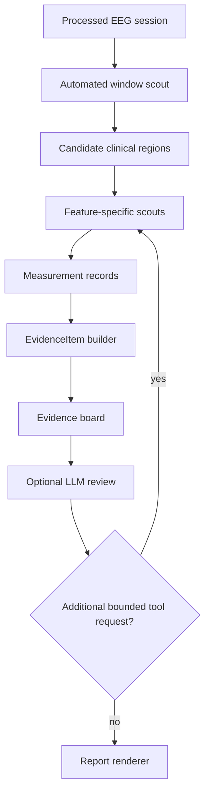

# EEGAgent Takeaways for a Multi-Agent EEG Reporting System

## Purpose

This note summarizes what is useful, and what is risky, in `rebootingLine/EEGAgent`
from the perspective of an evidence-first multi-agent EEG reporting system.

The main question is not whether EEGAgent should be copied as-is. It should not.
The useful question is whether its tool-driven clinical feature discovery ideas
can help a system that already has stronger evidence tracking, but is missing
important clinical features in the signal.

## Short Assessment

EEGAgent is best understood as an LLM-driven iterative tool loop:

```text
User question
-> LLM chooses a tool by writing a text command
-> Python regex parser extracts the tool call
-> local EEG tool runs on processed signal data
-> tool result is appended to the conversation
-> LLM decides whether to call another tool or answer
```

This is useful as a research prototype, but weak as a clinical reporting
backbone. The system relies heavily on prompt wording, tool descriptions, config
knowledge, and retrieved text. It does not have a strong typed evidence layer,
bounded planning graph, provenance-first artifact model, or robust tool-call
validation.

However, EEGAgent does contain a useful idea: clinical feature discovery can be
improved by giving the agent a toolbox of focused signal probes and letting the
workflow move from coarse screening to fine inspection.

## What EEGAgent Does Well

### 1. Tool-Based Clinical Probing

EEGAgent exposes tools for clinically meaningful dimensions:

- amplitude features
- PSD and frequency-band power
- left/right symmetry
- background versus slow wave versus seizure likelihood
- seizure versus non-seizure likelihood
- seizure versus artifact versus background likelihood
- eye movement versus muscle artifact likelihood
- sleep staging
- normal versus abnormal classification
- health versus MDD classification

This is a useful toolbox shape. Even if the implementations are not directly
reused, the categories are a good checklist for feature discovery.

### 2. Coarse-to-Fine Search Pattern

The tool set implies a useful search pattern:

```text
long EEG
-> coarse window screening, such as 10-second abnormality or seizure scouts
-> suspicious windows
-> finer 1-second/channel-level classifiers
-> feature-specific measurements
```

This pattern is worth adopting. A report pipeline that misses clinical features
usually needs a better discovery layer before the report renderer, not just
better prose generation.

### 3. Clinical Routing Metadata in Tool Descriptions

EEGAgent's tool descriptions often say when a tool should be used, not only
what the function computes. That is useful.

For example, instead of only documenting `compute_psd`, a stronger tool registry
should describe clinical routing intent:

```text
Use this tool to confirm focal slowing when a region shows persistent
delta/theta predominance compared with homologous channels.
```

This kind of metadata can help a planner, scout module, or LLM review node
propose better follow-up measurements.

## What Should Not Be Copied

### 1. Free-Form LLM Tool Execution

EEGAgent lets the LLM call tools by emitting text such as:

```text
<FUNCTION> seizureNormalModel_OneSecond
<ARGS> {"name": ["FP1-F7"], "start": 10, "end": 11}
```

The framework then parses that with regex and executes the function. This is
fragile. A clinical evidence system should not let free-form model text be the
source of truth for tool execution.

Prefer:

```text
LLM proposes bounded tool requests
-> validator checks schema, time bounds, channels, and registry permissions
-> orchestrator executes allowed tools
-> structured measurements become evidence candidates
```

### 2. Tool Results as Conversation-Only State

EEGAgent appends tool returns back into the assistant message and lets the LLM
interpret them. That makes the conversation the main state store.

For clinical reporting, tool outputs should become typed measurement records and
EvidenceItems with provenance:

- time provenance
- channel/space provenance
- measurement function and parameters
- values and thresholds
- downstream claim links

### 3. Raw-Like Reflection to the LLM

The `reflectData` tool is intended as a fallback that returns a 1-second signal
segment. In practice it returns processed registered data, not the original raw
EDF. It may also be difficult to serialize safely if numpy arrays are returned
directly.

Do not copy this pattern directly. A better design is a structured snippet
summary:

```json
{
  "window": "10.0-11.0s",
  "channels": ["FP1-F7"],
  "summary": {
    "peak_to_peak_uv": 82.1,
    "rms_uv": 19.4,
    "dominant_band": "theta",
    "sharp_transient_candidates": 2,
    "artifact_flags": ["possible_eye_movement"]
  },
  "preview_ref": "artifact/signal_preview_001.png"
}
```

This gives the review layer clinically useful evidence without asking the LLM to
interpret raw sample arrays.

### 4. Unbounded Looping

EEGAgent loops until the LLM stops emitting tool calls. There is no strong graph
state, stopping policy, or per-module budget in the core loop.

For a multi-agent system, each scout should have explicit budgets:

- max windows inspected
- max follow-up calls
- max channels per candidate
- required output schema
- failure and uncertainty states

## Recommended Integration Pattern

The best way to borrow from EEGAgent is to add a feature discovery layer in
front of the evidence board.



Feature-specific scouts could include:

- `BackgroundScout`
- `SlowingScout`
- `EpileptiformScout`
- `ArtifactScout`
- `AsymmetryScout`
- `SleepStateScout`

Each scout should output measurement records, not report text. The report should
still be rendered only from the evidence board.

## Practical Next Steps

1. Add a `ClinicalFeatureScout` layer before report generation.
2. Implement coarse window screening over the full processed EEG.
3. Create feature-specific follow-up modules for slowing, epileptiform activity,
   artifacts, asymmetry, and background organization.
4. Convert every scout result into typed measurement records.
5. Convert only validated measurement records into EvidenceItems.
6. Allow optional LLM review only for evidence gaps and bounded tool request
   proposals, not for creating signal-derived evidence.

## Bottom Line

EEGAgent is not a strong clinical orchestration framework. It is too dependent
on prompt-following and conversation state.

But it is useful as a reminder that clinical EEG reporting needs active feature
discovery, not just report rendering. The right borrowing strategy is:

```text
Borrow the scout toolbox and coarse-to-fine probing idea.
Do not borrow the free-form LLM tool loop as the source of clinical evidence.
```
